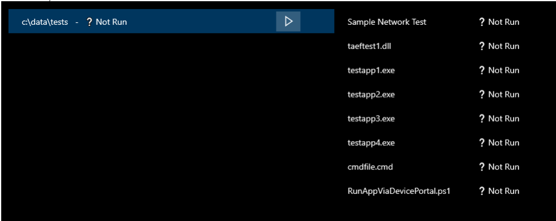
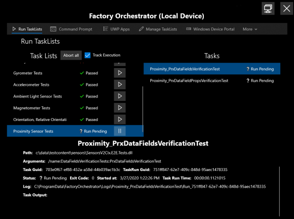
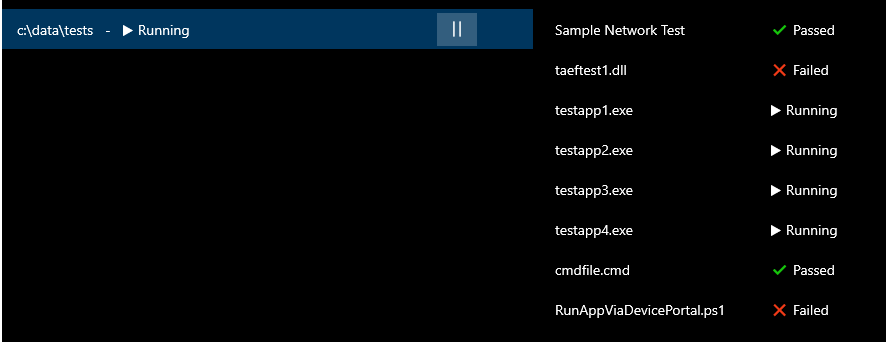
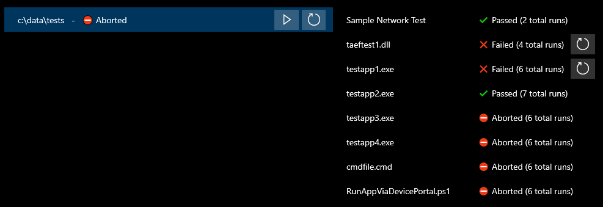
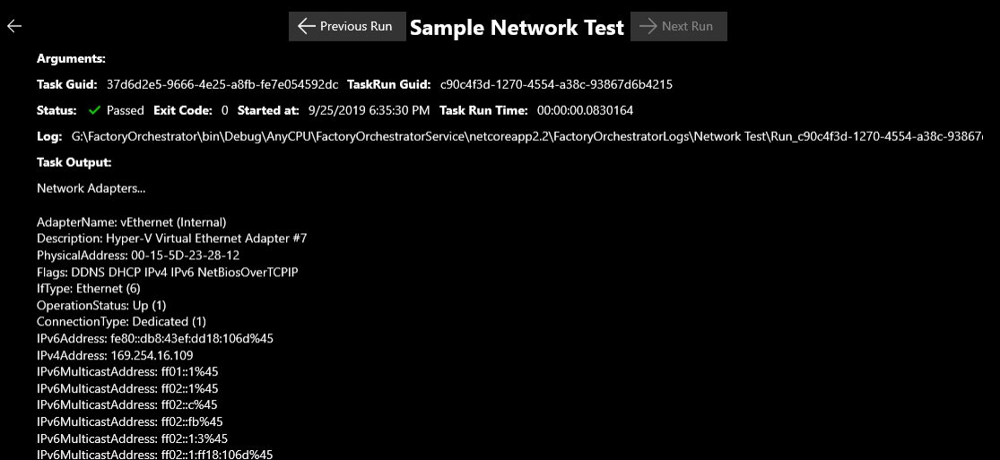

# Run tasks with Factory Orchestrator

Once you've created or imported a TaskList into Factory Orchestrator, you can run it. This topic covers the process of running a TaskList.

## Run a TaskList

When you click on the **Run TaskLists** menu item, you'll be see the "Run TaskLists" screen.

Hit the 'Play' button to run a TaskList. As tasks complete, the tasks' output will show next to the task.

While a TaskList is running, the Factory Orchestrator service will continue to run the tasks, even if you close the Factory Orchestrator app.

If you're running a task or a tasklist, the Factory Orchestrator UI allows you to easily monitor the status of any running task by displaying task status. You can disable this task status display by going to the **Run TaskLists** page and unchecking **Track Execution**.

As tasks complete, the Tasks' output will show next to the Task. While a TaskList is running, the Factory Orchestrator service will continue to run the tasks, even if you close the Factory Orchestrator app. A running TaskList can be "Aborted" by clicking the 'Pause' button.

If a TaskList is aborted you can either click the 'Play' button to resume executing it or the 'Re-run' button to restart the TaskList from the beginning.

A 'Re-run' button will also appear next to a Task if the TaskList is done executing and that Task failed. Press that button to retry the failed Task.

If you click on a Task, the results page will load and show you the status of the latest "run" (TaskRun) of that Task, including the any output of the Task. The results page also allows you to see the log file path for that run. You can also use the buttons at the top of the page to view older or newer runs of the Task, provided it has been run multiple times.

