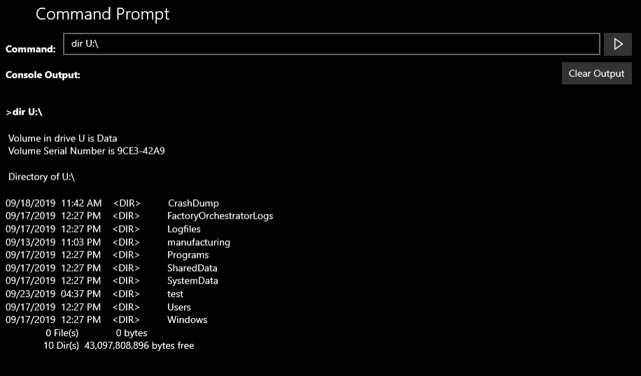

# Factory Orchestrator utilities

In addition to the ability to create, manage, and run TaskLists, the Factory Orchestrator app includes some basic utilities that you may be able to leverage while testing devices on the factory floor.

## UWP Apps

This launches a UWP app that's installed on a device under test (DUT). This allows you to launch a UWP directly from the Factory Orchestrator app by clicking on its name in the list of installed UWP apps.

Your device must be configured to launch into an environment that supports launching UWP apps.

You can exit a launched UWP with ALT+F4, or from Windows Device Portal.

## Command Prompt

A basic, non-interactive, command prompt that allows you to troubleshoot without having use other methods like TSHell or SSH to connect to your DUT.

While you can run commands and see output when using Factory Orchestrator's Command Prompt, it's not an interactive shell. If you run a command that requires additional input, you won't be able to enter the additional input.

## Transfer files

A basic file transfer function that enables you to transfer files to and from your device when you're connected from a technician PC. This feature is not visible in the Factory Orchestrator app when run the app and service on the same device.

### One-time setup (Windows 10 only)

First, install the Factory Orchestrator app on a Windows 10 system, using the instructions [here](factory-orchestrator.md#install-the-app-on-a-technician-pc).

Next, you need to give the Factory Orchestrator app full file system access for file transfer to work. Follow the directions on the [Windows 10 file system access and privacy](https://support.microsoft.com/en-us/help/4468237/windows-10-file-system-access-and-privacy-microsoft-privacy) page to give Factory Orchestrator access to the file system. You may need to launch the app at least once before it appears on the Settings app.

### Send file to a DUT

- From your Windows 10 device, launch Factory Orchestrator and connect to the IP address of the DUT.
- In the "Client File" textbox, enter the full path to a file on your Windows 10 device.
- In the "Server File" textbox, enter the full path of where you wish the file to be saved on the DUT. Make sure the location you're saving to is writeable.
- Click "Send Client File to Server" to transfer the file from the Windows 10 device to the device.

### Receive file from your device device

- From your Windows 10 technician PC, launch Factory Orchestrator and connect to the IP address of the DUT.
- In the "Server File" textbox, enter the full path to a file on the DUT.
- In the "Client File" textbox, enter the full path to where you wish the file to be saved on the Windows 10 device.
- Click "Save Server File to Client" to transfer the file to the DUT.