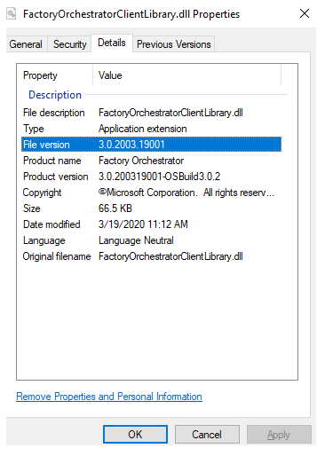
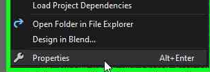

# Using the Factory Orchestrator client API

The Factory Orchestrator service, FactoryOrchestratorService.exe, provides a robust API surface for clients to interact with test devices via .NET Standard code. You can use these APIs to author advanced task orchestration code to programmatically interact with the service outside of what the app provides.

All FactoryOrchestratorClient API calls other than `Connect()` are [asynchronous](https://docs.microsoft.com/dotnet/csharp/async).

The FactoryOrchestator service uses [semver](https://semver.org/) versioning. If the target device is running a different Factory Orchestrator build than one used to create the client program, you need to ensure that the program you build will run as expected by calling Client.GetServiceVersionString() and comparaing against the client API version. If there is a major version mismatch your program may not work as expected and either the client program or test device should be updated so the major versions match. You can check the version of the client API by:

- Manually inspecting the properties of the FactoryOrchestratorClientLibrary.dll file used by your program

    

- Programatically by the following code snippet:

```C#
using System.Reflection;

...

var client = new FactoryOrchestratorClient(ipAddress);
client.GetClientVersionString();
```

If you are writing a UWP app that uses the Factory Orchestrator Client API, you should use the FactoryOrchestratorUWPClient class instead of FactoryOrchestratorClient. The FactoryOrchestratorUWPClient APIs are identical to the FactoryOrchestratorClient APIs. The UWP Client is available in FactoryOrchestratorUWPClientLibrary.dll.

The complete Factory Orchestrator Client API reference is available at: `FactoryOrchestrator\Documentation\api\index.html`.

## Using FactoryOrchestratorUWPClient.dll in a UWP

If you're using FactoryOrchestratorUWPClient.dll in a UWP, you have to configure Visual Studio so that it doesn't build with .NET Native.

1. Load your app project in visual studio.
2. Right click the app project and select **Properties**:

    
    

3. On the **Build** tab, select **All Configurations** and **All Platforms**:

    

4. Uncheck **Compile with .NET Native tool chain**

    

5. Rebuild and re-publish your app. The app dependencies will be different for your newly built app, so you'll need to install different framework packages with your app;

    

After building without the .NET native tool chain, your app should run successfully.

## Factory Orchestrator client sample

A sample .NET Core program that communicates with the Factory Orchestrator service is available in the Faactory Orchestrator GitHub repo at: `<Link to sample app>`. Copy the entire directory to your technician PC, then open ClientSample.csproj in Visual Studio 2019. (Visual Studio 2019 is required for working with NET Core 2.2 and newer.)

The sample shows you how to connect to a remote test device running Factory Orchestrator service, copy files to that device, execute test content, and retrieve the test results from the device both using an API and by retreiving the log files.

### Factory Orchestrator client sample usage

Once the sample is built, create a folder on your technican PC with test content and a FactoryOrchestratorXML file that references the test content in the location it will execute from on the test device. Then, run the sample by calling:

```cmd
dotnet ClientSample.dll <IP Address of DUT> <Folder on technician PC with test content AND FactoryOrchestratorXML files> <Destination folder on DUT> <Destination folder on this PC to save logs>
```

The sample will then connect to the test device, copy files to that device, execute test content, and retrieve the test results from the device both using an API and by retreiving the log files. You will be able to monitor the progress of the sample in the console window, on the DUT (if it is running the Factory Orchestrator app), and on the Factory Orchestrator app on the Technician PC (if it is connected to the test device).
